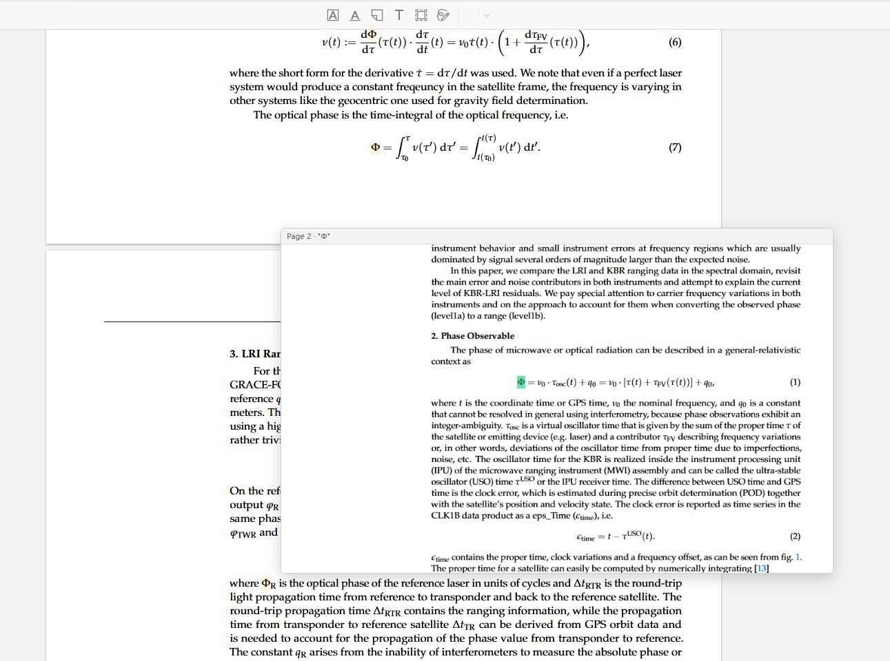

# Zotero Var Highlighter

---

[下载最新安装包 XPI](https://github.com/taotaozsky2025-beep/zotero-var-highlighter/releases/latest/download/zotero-var-highlighter.xpi)

## 简介

**Zotero Var Highlighter** 是一款辅助研究人员阅读复杂论文的插件，尤其适合数学变量密集的论文。在 PDF 阅读器中选中任意文本，插件会即时高亮全文所有出现位置，并以不同颜色**标记第一次出现的位置**（通常是变量的定义处）。

## 功能介绍

### 自动高亮

在 Zotero PDF 阅读器中**选中任意文本**（变量名、符号或关键词）后，插件自动完成：

1. **获取**选中文本。
2. **搜索**整个 PDF 文档中该文本的所有出现位置。
3. **高亮**所有匹配项（橙色/黄色）。
4. 将**全文第一次出现**的位置标记为绿色——通常对应变量的定义处。

### 悬停预览 *(v0.2.0 新增)*

将鼠标悬停在任意**非首匹配高亮**（橙色）上超过 350 ms，即可弹出**预览窗口**，显示首次出现所在页面的截图。无需跳转页面，即可一眼看到变量的定义位置。

- 悬停在**首匹配**（绿色）上**不会**触发预览。
- 鼠标移开后预览窗口自动消失。

### 自定义设置 *(v0.2.0 新增)*

打开 **Zotero → 设置 → Zotero Var Highlighter** 进行个性化配置：

| 设置项 | 说明 | 默认值 |
|---|---|---|
| 首匹配颜色 | 第一次出现的高亮颜色 | 绿色 `#00b450` |
| 首匹配透明度 | 第一次出现的高亮透明度 | 55% |
| 其他匹配颜色 | 其余出现位置的高亮颜色 | 橙色 `#ff9e00` |
| 其他匹配透明度 | 其余出现位置的高亮透明度 | 45% |
| 预览最大宽度 | 悬停预览窗口的最大宽度（像素） | 800 |
| 预览最大高度 | 悬停预览窗口的最大高度（像素） | 500 |
| 悬停延迟 | 悬停多久后显示预览（毫秒） | 350 |

## 效果截图

*绿色高亮为全文首次出现处（变量定义位置），橙色高亮为其余所有出现位置。*

## 兼容性

| Zotero 版本 | 状态 |
|---|---|
| Zotero 7 | 支持 |
| Zotero 8 | 支持 |
| Zotero 9 | 支持 *(v0.2.0 新增)* |

## 使用方法

1. 在 Zotero 中安装 XPI 文件（**工具 → 插件 → 从文件安装插件**）。
2. 在 Zotero 中打开任意 PDF。
3. 用鼠标选中一个单词或变量，高亮即时生效。
4. 将鼠标悬停在橙色高亮上，可预览变量定义所在位置。

## 更新日志

### v0.2.0
- **新增**：悬停预览功能——悬停橙色高亮即可弹窗显示首次出现处。
- **新增**：可在设置面板中自定义高亮颜色、透明度和预览窗口尺寸。
- **新增**：支持 Zotero 9。
- **优化**：冷启动优化——插件在首次选词前预热 PDF.js 阅读器，避免初次使用时出现滚动抖动。

### v0.1.0
- 首次发布。
- 自动高亮 PDF 全文所有匹配项。
- 首匹配绿色标记，快速定位变量定义。
